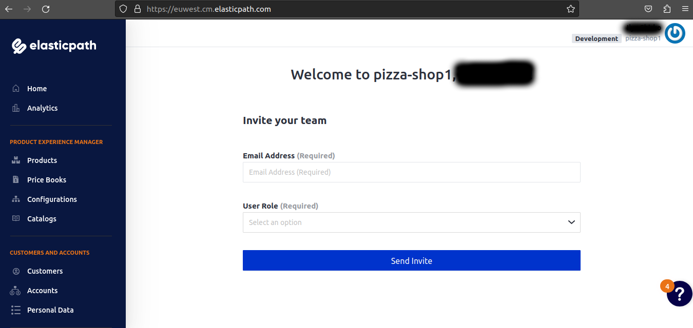
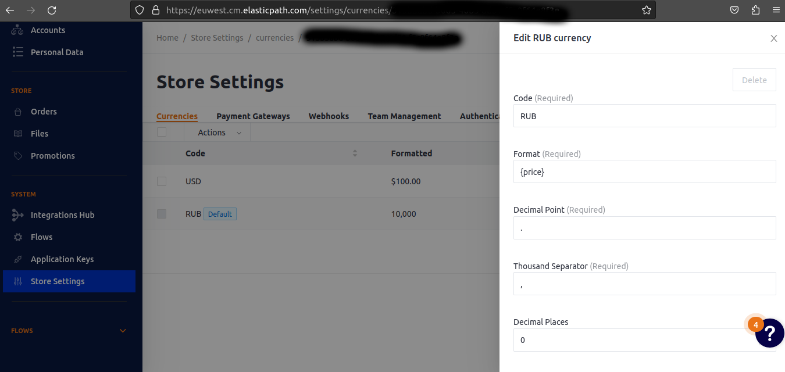
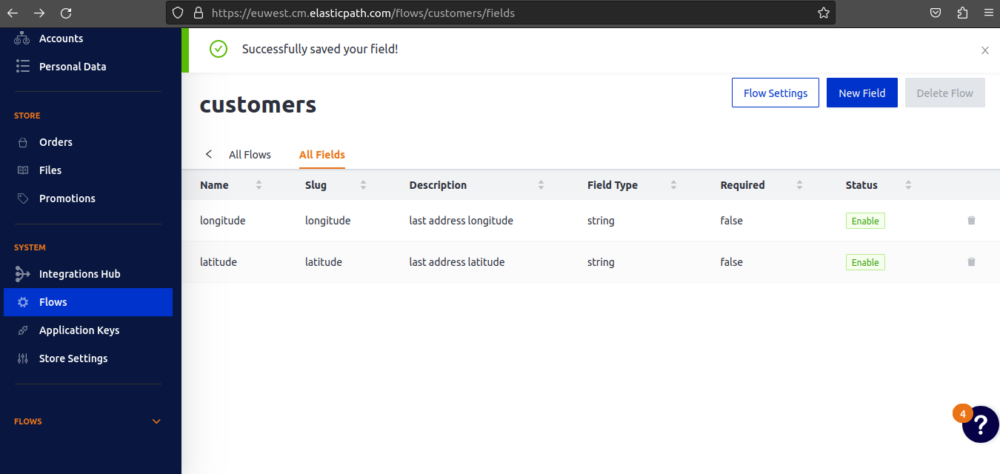

# Интернет-магазин для сети пиццерий.
Frontend - [Telegram](https://docs.python-telegram-bot.org/en/stable/)
Backend (with admin) - [ElasticPath](https://euwest.cm.elasticpath.com/)


## Установка и настройка
Для распаковки проекта понадобится python (3.10.6) и poetry (1.2.0)
```sh
git clone https://github.com/ilyashirko/pizza-shop &&
cd pizza-shop &&
python3 -m venv env &&
source env/bin/activate &&
poetry install &&
mv .env.example .env
```
Необходимо зарегистрироваться в [ElasticPath](https://euwest.cm.elasticpath.com/).  
Если вы все сделали правильно вы получите доступ в ЛК:  


#### Формируем .env файл
`STORE_ID`, `CLIENT_SECRET` и `CLIENT_ID` получаем в [настройках ElasticPath](https://euwest.cm.elasticpath.com/application-keys).  

`TELEGRAM_BOT_TOKEN` получаем при регистрации бота для нашего магазина в [BotFather](https://t.me/botfather).  

`YANDEX_GEO_API_KEY` получаем в [кабинете разработчика яндекс](https://developer.tech.yandex.ru/services/).  

`LOGO_IMAGE` - фото, которое будет отправлено пользователю если по какой либо причине будет недоступна фотография товара.  

`PRICEBOOK_ID`, `HIERARCHY_ID`, `NODE_ID`, `CATALOG_ID`, `PIZZERIAS_FLOW_ID` -  
ID необходимых для работы разделов вашего ресторана.  
Вы можете создать их в процессе импорта товаров и адресов в `load_db.py` (процесс будет описан ниже).  
Либо можете создать их через web-интерфейс и ввести в `.env`, тогда скрипт будет использовать ваши значения.  

#### Настраиваем магазин в ElasticPath
1. Необходимо настроить валюту. В программе используются рубли РФ.


2. Необходимо добавить flow `customers` и добавить туда `longitude` и `latitude`. Поскольку это встроеный flow, после создания, в разделе Flows перед моделью Customers будет иконка `Core`.


#### Завершаем настройку
1. Необходимо добавить файл `privacy_policy.pdf` в корень проекта, в файле должна быть политика конфиденциальности для приема персональных данных у пользователей.  
2. Необходимо добавить дежурное фото, путь и название которого вы указали в `.env` в переменной `LOGO_IMAGE`  

## Загрузка данных
Для загрузки данных используйте скрипт `load_db.py` с необходимыми аргументами.

#### Загрузка меню
Вам потребуется `.json` файл с пиццами к продаже. Внутри файла должен быть список словарей (см. пример ниже), где один словарь - одна пицца.  
```
Пример файла с товарами (пиццами)
[
    {
        "name": "Чизбургер-пицца",
        "description": "мясной соус болоньезе, моцарелла, лук, соленые огурчики, томаты, соус бургер",
        "product_image": {
            "url": "https://url_for_main_image_of_your_pizza"
        },
        "price": 395
    },
    ...
]
```
> :heavy_exclamation_mark: **стоимость указывается в рублях, без копеек.**  

```sh
python3 load_db.py --menu ПУТЬ_ДО_ФАЙЛА_С_МЕНЮ
```

Для загрузки данных вам потребуется ввести данные разделов:
- **данные каталога:**
    - `CATALOG_ID` в `.env` файле 
    **ИЛИ**
    - добавить аргумент `--catalog_id ID_ЦЕЛЕВОГО_КАТАЛОГА`
    **ИЛИ**
    - добавить аргумент `--new_catalog_name ИМЯ_НОВОГО_КАТАЛОГА`
- **данные раздела:**
    - `HIERARCHY_ID` в `.env` файле 
    **ИЛИ**
    - добавить аргумент `--hierarchy_id ID_ЦЕЛЕВОГО_РАЗДЕЛА`
    **ИЛИ**
    - добавить аргумент `--new_hierarchy_name ИМЯ_НОВОГО_РАЗДЕЛА`
- **данные подраздела:**
    - `NODE_ID` в `.env` файле 
    **ИЛИ**
    - добавить аргумент `--node_id ID_ЦЕЛЕВОГО_ПОДРАЗДЕЛА`
    **ИЛИ**
    - добавить аргумент `--new_node_name ИМЯ_НОВОГО_ПОДРАЗДЕЛА`
- **данные прайс-листа:**
    - `PRICEBOOK_ID` в `.env` файле 
    **ИЛИ**
    - добавить аргумент `--pricebook_id ID_ЦЕЛЕВОГО_ПРАЙС-ЛИСТА`
    **ИЛИ**
    - добавить аргумент `--new_pricebook_name ИМЯ_НОВОГО_ПРАЙС-ЛИСТА`

> :heavy_exclamation_mark: **Если хотя бы одного параметра не будет введено ни одним способом - скрипт завершится с ошибкой!**

#### Загрузка адресов пиццерий

Вам потребуется `.json` файл с данными ваших пиццерий. Внутри файла должен быть список словарей (см. пример ниже), где один словарь - одна пиццерия.  
```Пример файла с товарами (пиццами)
[
    {
        "alias": "Афимолл",
        "address": {
            "full": "Москва, набережная Пресненская дом 2",
        },
        "coordinates": {
            "lat": "55.749299",
            "lon": "37.539644"
        }
    },
    ...
]
```

```sh
python3 load_db.py --menu ПУТЬ_ДО_ФАЙЛА_С_ПИЦЦЕРИЯМИ
```


Для загрузки данных вам потребуется ввести данные группы:
- `FLOW_ID` в `.env` файле 
**ИЛИ**
- добавить аргумент `--flow_id ID_ЦЕЛЕВОЙ_ГРУППЫ`
**ИЛИ**
- добавить аргумент `--new_flow_name ИМЯ_НОВОЙ_ГРУППЫ`

> :heavy_exclamation_mark: Вне зависимости от того, указали ли вы ID действующего раздела или указали имя нового, скрипт дополнит группу полями `address` (string), `alias` (string), `longitude` (float), `latitude` (float), если таковых не будет в указанном разделе.

#### Добавление поля группы
Для загрузки данных вам потребуется ввести данные группы и нового поля:
- **данные группы:**
    - `FLOW_ID` в `.env` файле 
    **ИЛИ**
    - добавить аргумент `--flow_id ID_ЦЕЛЕВОЙ_ГРУППЫ`
- **имя поля** - `--new_field_name ИМЯ_НОВОГО_ПОЛЯ`
- **тип нового поля** - `--new_field_type ТИП_НОВОГО_ПОЛЯ`
    > :heavy_exclamation_mark: По состоянию на 19.02.2023 доступны следующие типы полей - `string`, `integer`, 
- **значение по умолчанию** - `--default_value ЗНАЧЕНИЕ_ПО_УМОЛЧАНИЮ`
    > :heavy_exclamation_mark: Обязательно указывайте значение по умолчанию во избежание потенциальных багов в работе сервиса. Выбирайте безопасное значение, поскольку если вы забудете его изменить на актуальное, программа будет действовать на основании дефолтного значения.